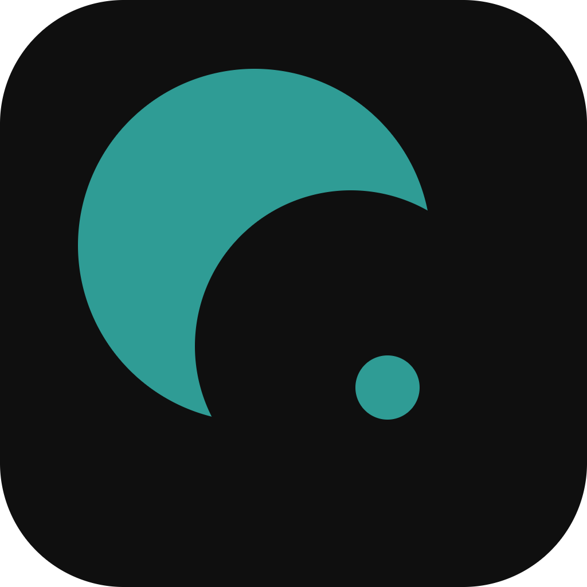
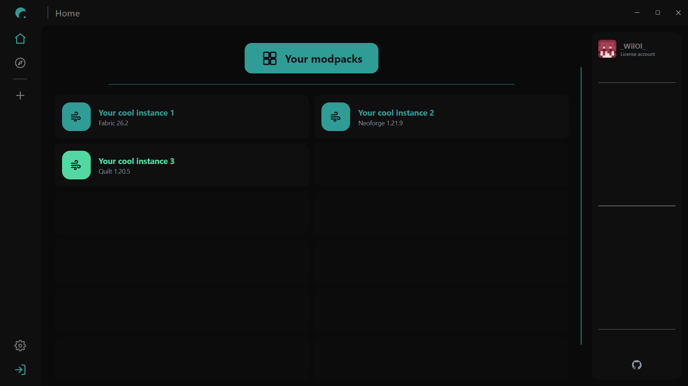
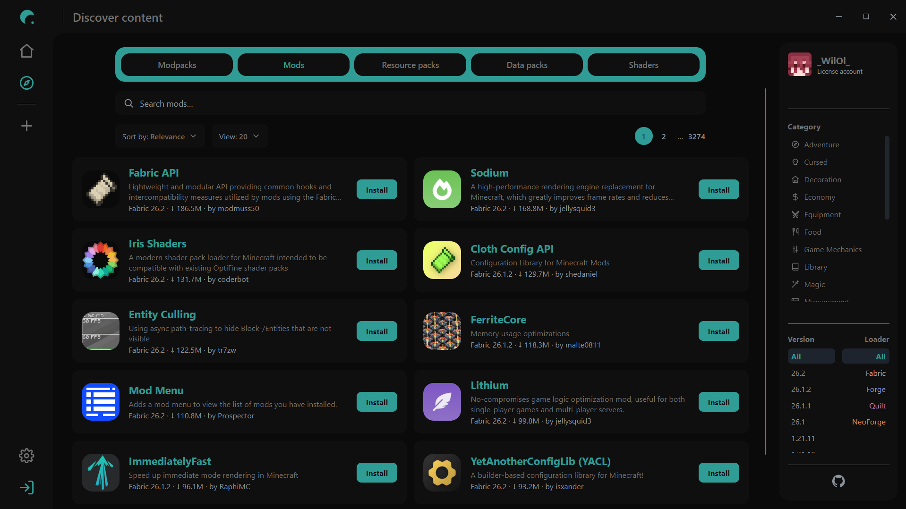

<div align="center">
  

  <h1>C² Launcher</h1>

  <p><em>A clean, fast open-source Minecraft launcher - browse, install and manage modpacks and content from Modrinth, all in one place without any ads.</em></p>

  <!-- Optional badges — edit/remove as you like -->
  <p>
    
    
    
  </p>
</div>

---

## Overview

C² Launcher is a desktop Minecraft launcher built with Electron + React. It lets you do everything you need: create instances, discover content from [Modrinth](https://modrinth.com), and install modpacks, mods, resource packs, data packs and shaders with a couple of clicks.

<!-- Hero screenshot of the Home page -->
<div align="center">
  
</div>

---

## Features

- **Instances** — create and manage multiple Minecraft installs from the Home page.
- **Discover** — browse Modrinth content by type (modpacks, mods, resource packs, data packs, shaders) with search, sort and filters.
- **Smart filters** — filter by game version, mod loader (Fabric, Forge, Quilt, NeoForge) and category.
- **One-click install** — install modpacks as new instances, or add content straight into an existing instance.
- **Rich project view** — descriptions, gallery and version history for any project.
- **Account support** — sign in to use your account with the launcher.
- **Modern UI** — custom frameless window, smooth animations, dark theme.

---

## Screenshots

| Home | Discover |
| :---: | :---: |
|  |  |

---

## Installation

1. Go to the [**Releases**](https://github.com/Shroud-y/c2launcher/releases) page.
2. Download the latest installer for your OS:
   - **Windows** — `c2-launcher-setup-x.y.z.exe`
   - **Linux** — `.AppImage` or `.deb`
3. Run it and follow the prompts.

ℹ️ Windows may show a SmartScreen "unknown publisher" warning because the build isn't code-signed. Click **More info → Run anyway**.

---

## Development

Built with **Electron**, **React**, **TypeScript**, **Vite** ([electron-vite](https://electron-vite.org)) and **pnpm**.

### Setup

```bash
# clone
git clone https://github.com/Shroud-y/c2launcher.git
cd c2launcher

# install dependencies
pnpm install

# run in development
pnpm dev
```

## Credits

- Content powered by the [Modrinth API](https://docs.modrinth.com).
- Built on [Electron](https://electronjs.org) and [React](https://react.dev).

---

## License

Released under the [MIT License](LICENSE).

<div align="center">
  <sub>Made with 💚 by C² contributors</sub>
</div>
